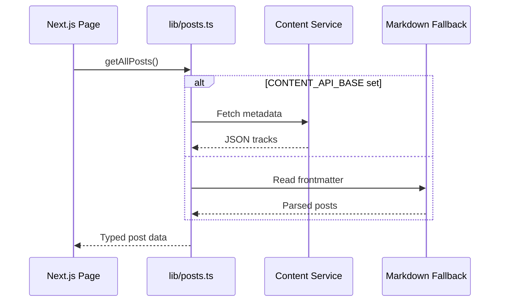
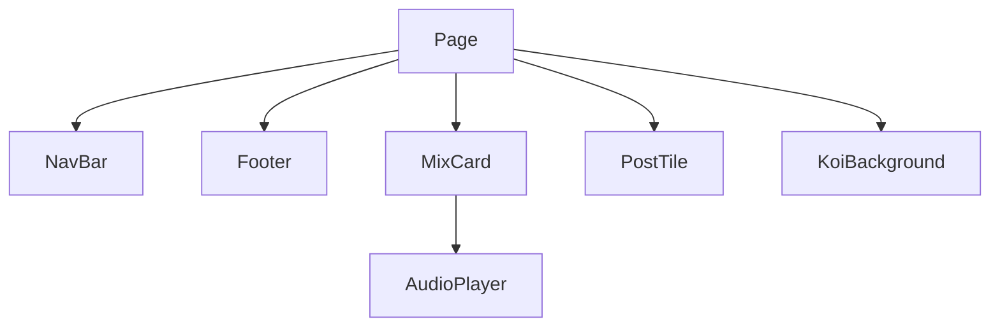
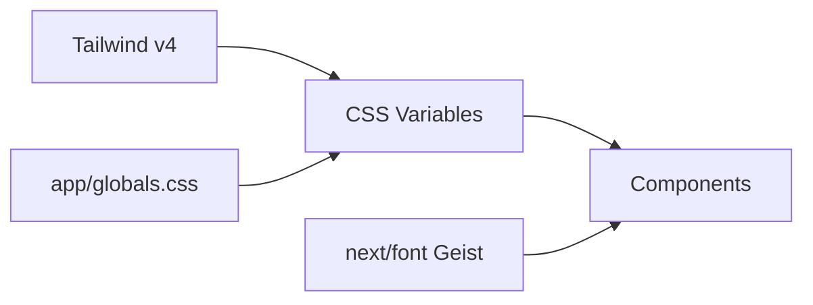
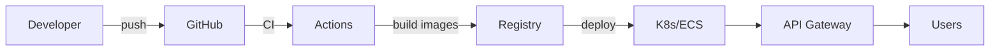
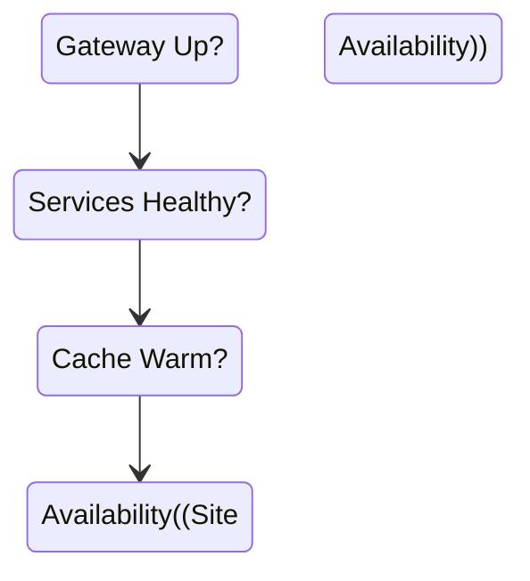
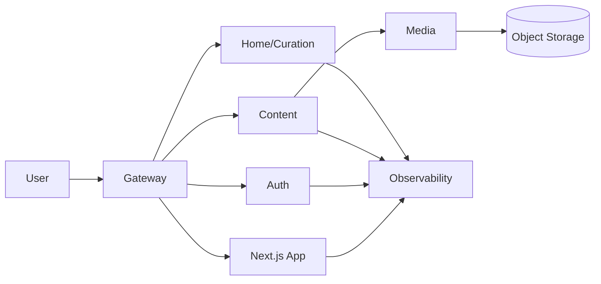

# VIBES.FM System Architecture

## Repository Structure

- `web/`: Next.js 15 App Router project that contains all application code.
- `web/content/`: Markdown sources (JSON frontmatter + Markdown body) for mixes/posts that are baked into the static build.
- `web/public/`: Static assets served verbatim.
- Root-level docs (`README.md`, `Description.md`, `STATIC_EXPORT.md`) describe setup and deployment expectations.

```mermaid
graph TD
    Repo[Root Repo]
    Repo --> web[web/ (Next.js app)]
    web --> content[web/content]
    web --> public[web/public]
    Repo --> docs[Root Docs]
```

## Application Shell

- `app/layout.tsx` defines the HTML scaffold, global fonts (Geist families), light/dark defaults, and composes the persistent `NavBar` and `Footer`.
- `app/globals.css` bootstraps Tailwind CSS v4 (via `@import "tailwindcss"`) and exposes CSS custom properties used across server and client components.
- The layout renders with `className="dark"` on `<html>`, so the site defaults to a dark theme while keeping light theme variables in CSS for future toggles.

```mermaid
graph LR
    Layout[app/layout.tsx]
    Layout -->|wraps| NavBar
    Layout -->|wraps| Footer
    Layout --> Globals[app/globals.css]
    Globals -->|provides tokens| Components
    Layout --> HTML<html class="dark">
```

## Routing Model

- Uses the Next.js App Router with file-system routes inside `app/`.
- Key routes:
  - `app/page.tsx`: Landing page combining featured mixes, marketing copy, newsletter form, and the animated `KoiBackground`.
  - `app/mixes/page.tsx`: Grid of demo mixes rendered via the reusable `MixCard` component.
  - `app/vibes/page.tsx` and `app/about/page.tsx`: Simple informational pages ready to be populated with real content.
  - `app/posts/[slug]/page.tsx`: Dynamic route for mix write-ups, tracklists, and embeds. Implements `generateStaticParams` and `dynamicParams = false` so every Markdown post is prerendered for static export.

```mermaid
flowchart LR
    Router[Next.js App Router]
    Router --> Landing[app/page.tsx]
    Router --> Mixes[app/mixes/page.tsx]
    Router --> Vibes[app/vibes/page.tsx]
    Router --> About[app/about/page.tsx]
    Router --> Posts[app/posts/[slug]/page.tsx]
```

## Content & Data Layer

- `lib/posts.ts` currently reads `.md` files from `content/posts`, but is being refactored into a thin client that calls the Content Service when `CONTENT_API_BASE` is configured; the Markdown path remains a local dev fallback.
- Frontmatter is still stored as JSON enclosed by `---` fences so those documents can seed the Content Service or power offline previews before publishing.
- Helper `getAllPosts()` and `getPostBySlug()` now act as adaptors: they hydrate data from the service (or the Markdown fallback) and return typed objects to server components at runtime.
- `getCoverFromEmbed()` continues to infer YouTube thumbnail URLs when a cover is not provided, supporting richer cards without extra authoring work.



## Presentation Components

- `components/NavBar.tsx` and `components/Footer.tsx` supply the persistent chrome, using `usePathname()` client-side to highlight the active route.
- `components/MixCard.tsx` drives card layout for mixes/posts and embeds the `AudioPlayer`.
- `components/AudioPlayer.tsx` is a client component that manages playback state, speed control, and gracefully handles missing audio sources.
- `components/PostTile.tsx` provides a smaller card format for post listings (currently unused, but ready for blog indexes or sidebars).
- `components/KoiBackground.jsx` renders an animated canvas comet field, mounted client-side and layered behind main content with absolute positioning.



## Styling & Design System

- Tailwind CSS v4 powers utility classes; global CSS defines theme tokens and sets baseline fonts/colors.
- Component styling leans on Tailwind utilities combined with CSS variables for consistent dark-mode appearance.
- `next/font` configuration in `app/layout.tsx` preloads Geist fonts and attaches them as CSS variables consumed by Tailwind.



## Build & Deployment

- `next.config.ts` targets the Node runtime (no `output: "export"`) so App Router pages render dynamically and fetch data through the gateway.
- GitHub Actions builds/pushes containers for the Next.js web app plus each microservice; deployments roll out via the platform of choice (Kubernetes/ECS) behind a shared API Gateway/ingress.
- `package.json` scripts still power local `dev`/`build`, but the CI pipeline now runs tests, type checks, and image builds before promoting artifacts to staging/production.
- Secrets, database migrations, and object storage buckets are managed per environment (e.g., Terraform modules) so services share consistent configuration.



## Operational Notes

- Runtime data now flows through the gateway to the Content/Home services, so site availability depends on those APIs plus their caches (Next.js request memoization/SWR) instead of static assets.
- Client components (`NavBar`, `AudioPlayer`, `KoiBackground`) remain isolated while server components stream data from microservices, preserving lean bundles and enabling suspense-driven loading states.
- Adding new sections (e.g., a `/posts` index) involves defining contracts in the Content Service and reusing the shared typed clients, rather than editing filesystem data.



## Dynamic Microservices Layer (roadmap)

- **Transition plan**: keep the exported Next.js shell for structure, but hydrate key routes (e.g., `app/page.tsx`) so they fetch JSON from the gateway at runtime; full server-side rendering can be phased in later without layout changes.
- **API Gateway + Frontend**: retain the static Next.js shell for branding; route all dynamic calls through a gateway that handles SSL, auth headers, and traffic shaping.
- **Auth Service**: manages registration, login, password resets, and issues JWTs consumed by the gateway and other services.
- **Content Service**: stores music metadata (`title`, `artists[]`, `year`, `album`, `set`, `tags[]`, `file_name`, `file_path`, `storage_status`) and exposes CRUD/search APIs consumed by the home page. Each record references a `media_asset_id` supplied by the Media Service.
- **Media Service**: owns file uploads, validates existence in object storage, emits "asset-status" events (exists/missing/external) back to the Content Service, and returns signed playback URLs to keep the static player UI unchanged.
- **Home/Curation Service**: assembles featured playlists and homepage blocks, returning JSON that existing Next components render client-side so visual styling remains identical.
- **Shared observability**: centralized logging, metrics, and tracing across services, plus lightweight frontend telemetry (e.g., edge logs + RUM) to correlate UI events with backend calls.


