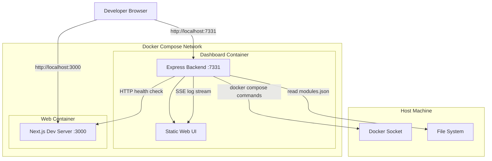

# Developer Dashboard - Architecture & Execution Plan

## Issue Reference
**Issue #4: Developer Dashboard**

> A developer dashboard which runs on an independent container and can be used to launch all the modules to test the api, connections and endpoint health. The dashboard can be accessed from a browser and has various tabs one of which can be used to live monitor various module status or health and also access tail logs from the selected module.

---

## 1. Assumptions & Clarifying Questions

### Assumptions

1. **"Modules" Definition**: Since no modules currently exist in the codebase, we interpret "modules" as Docker Compose services that can be defined and extended over time. Initially, this includes:
   - `web` - The Next.js development server
   - `dashboard` - The developer dashboard itself
   - Future services can be added via configuration

2. **Dev-Only Tooling**: The dashboard is strictly for local development and will NOT be deployed to GitHub Pages. All dashboard-related files are isolated in `devtools/` to prevent accidental inclusion in production builds.

3. **No Authentication Required**: Since this is local dev tooling bound to localhost, authentication is not implemented initially but can be added if needed.

4. **Docker Socket Access**: The dashboard requires access to the Docker socket to manage containers and stream logs.

### Clarifying Questions (for future consideration)

- Should the dashboard support remote deployment for team-wide dev environments?
- Are there specific APIs or external services that need health monitoring?
- Should module configurations be stored persistently or reset on restart?

---

## 2. Goal and Non-Goals

### Goals
- Provide a web-based dashboard accessible at `http://localhost:7331`
- Display real-time status of all configured modules (running/stopped/unhealthy)
- Allow starting, stopping, and restarting modules from the UI
- Stream live logs from any selected module
- Support health checks via HTTP endpoints where available
- Make module configuration extensible via a config file

### Non-Goals
- Production deployment of the dashboard
- Authentication/authorization (dev-only, localhost-bound)
- Modifying the existing Next.js app or GitHub Pages deployment
- Persistent storage of logs or metrics

---

## 3. Proposed Architecture



### Component Responsibilities

| Component | Location | Responsibility |
|-----------|----------|----------------|
| Express Backend | `devtools/dashboard/src/server.js` | API endpoints, Docker management, log streaming |
| Static Web UI | `devtools/dashboard/public/` | Tabbed interface for status, logs, controls |
| Module Config | `devtools/modules.json` | Defines available modules and their properties |
| Docker Compose | `docker-compose.dev.yml` | Orchestrates all dev services |

---

## 4. Interfaces and Contracts

### HTTP Endpoints (Dashboard Backend)

| Method | Endpoint | Description |
|--------|----------|-------------|
| GET | `/api/modules` | List all configured modules with current status |
| GET | `/api/modules/:name/status` | Get detailed status of a specific module |
| POST | `/api/modules/:name/start` | Start a module |
| POST | `/api/modules/:name/stop` | Stop a module |
| POST | `/api/modules/:name/restart` | Restart a module |
| GET | `/api/modules/:name/logs` | SSE stream of module logs |
| GET | `/api/health` | Dashboard health check |

### Module Status Response Schema

```json
{
  "name": "web",
  "displayName": "Next.js Dev Server",
  "status": "running|stopped|unhealthy",
  "health": {
    "url": "http://web:3000",
    "status": "healthy|unhealthy|unknown",
    "lastCheck": "2025-01-01T00:00:00Z"
  },
  "ports": ["3000:3000"],
  "uptime": "2h 30m"
}
```

### Environment Variables

| Variable | Default | Description |
|----------|---------|-------------|
| `DASHBOARD_PORT` | `7331` | Port for dashboard UI |
| `DOCKER_HOST` | `/var/run/docker.sock` | Docker socket path |
| `MODULES_CONFIG` | `./modules.json` | Path to modules configuration |

### CLI Commands

```bash
# Start all dev services
docker compose -f docker-compose.dev.yml up -d

# Start only the dashboard
docker compose -f docker-compose.dev.yml up -d dashboard

# View dashboard logs
docker compose -f docker-compose.dev.yml logs -f dashboard

# Stop all services
docker compose -f docker-compose.dev.yml down
```

---

## 5. Security and Access Boundaries

### Localhost Binding
- Dashboard binds to `127.0.0.1:7331` by default (not `0.0.0.0`)
- Prevents accidental exposure on LAN/public networks

### Docker Socket Access
- Required for container management
- Dashboard container runs with limited capabilities
- No privileged mode required

### Isolation from Production
- All dashboard files in `devtools/` directory
- `docker-compose.dev.yml` clearly named for dev use
- No modifications to `.github/workflows/pages.yml`
- Dashboard not included in Next.js build output

---

## 6. Operational Model

### Running Locally

```bash
# First time setup
cd /path/to/vibes_fm

# Start all dev services (dashboard + web)
docker compose -f docker-compose.dev.yml up -d

# Access dashboard
open http://localhost:7331

# Access Next.js app
open http://localhost:3000

# Stop all services
docker compose -f docker-compose.dev.yml down
```

### Log Collection
- Logs streamed via `docker compose logs -f --tail=200 <service>`
- Real-time streaming to browser via Server-Sent Events (SSE)
- No persistent log storage (ephemeral, dev-only)

### Health Monitoring
- Periodic HTTP health checks to configured endpoints
- Status polling every 5 seconds
- Visual indicators: green (healthy), yellow (unknown), red (unhealthy/stopped)

---

## 7. Execution Plan

### Phase 0: Setup & Scaffolding (S)
**Tasks:**
- [x] Create `devtools/` directory structure
- [ ] Create `docker-compose.dev.yml` at repo root
- [ ] Create `devtools/modules.json` configuration
- [ ] Create `devtools/dashboard/Dockerfile`
- [ ] Create `devtools/dashboard/package.json`

**Acceptance Criteria:**
- Directory structure exists
- Docker Compose file is valid (`docker compose config`)

### Phase 1: Dashboard Backend (M)
**Tasks:**
- [ ] Implement Express server (`devtools/dashboard/src/server.js`)
- [ ] Implement `/api/modules` endpoint
- [ ] Implement `/api/modules/:name/status` endpoint
- [ ] Implement start/stop/restart endpoints
- [ ] Implement SSE log streaming endpoint
- [ ] Add health check polling logic

**Acceptance Criteria:**
- All API endpoints respond correctly
- Can start/stop modules via API
- Log streaming works via curl

### Phase 2: Dashboard Frontend (M)
**Tasks:**
- [ ] Create HTML structure with tabs (`devtools/dashboard/public/index.html`)
- [ ] Implement module status display
- [ ] Implement start/stop/restart buttons
- [ ] Implement log viewer with auto-scroll
- [ ] Add CSS styling for dark theme

**Acceptance Criteria:**
- UI loads at http://localhost:7331
- All tabs functional
- Real-time log updates visible

### Phase 3: Integration & Testing (S)
**Tasks:**
- [ ] Test full workflow: start dashboard, view web module status
- [ ] Test log streaming from web module
- [ ] Test start/stop/restart controls
- [ ] Document usage in README

**Acceptance Criteria:**
- End-to-end workflow works
- Documentation complete

---

## 8. Testing Plan

### Manual Smoke Tests

1. **Dashboard Startup**
   ```bash
   docker compose -f docker-compose.dev.yml up -d dashboard
   curl http://localhost:7331/api/health
   # Expected: {"status":"ok"}
   ```

2. **Module Listing**
   ```bash
   curl http://localhost:7331/api/modules
   # Expected: JSON array of modules with status
   ```

3. **Start/Stop Module**
   ```bash
   curl -X POST http://localhost:7331/api/modules/web/start
   curl http://localhost:7331/api/modules/web/status
   curl -X POST http://localhost:7331/api/modules/web/stop
   ```

4. **Log Streaming**
   ```bash
   curl http://localhost:7331/api/modules/web/logs
   # Expected: SSE stream of log lines
   ```

5. **UI Verification**
   - Open http://localhost:7331 in browser
   - Verify tabs: Overview, Logs, Settings
   - Verify module cards show correct status
   - Verify log viewer updates in real-time

---

## 9. Risks and Alternatives

### Risk 1: Docker Socket Security
**Risk:** Mounting Docker socket gives container root-equivalent access
**Mitigation:** Bind to localhost only, document security implications
**Alternative:** Use Docker API over TCP with TLS (more complex setup)

### Risk 2: Module Definition Ambiguity
**Risk:** "Modules" concept may not match user expectations
**Mitigation:** Make modules configurable via JSON, document extensibility
**Alternative:** Hard-code specific services (less flexible)

### Alternative Approaches

| Approach | Pros | Cons |
|----------|------|------|
| **Node.js + Static UI (chosen)** | Single ecosystem, simple, fast | Less sophisticated UI |
| **Python FastAPI + React** | Type-safe API, rich UI | Two ecosystems, build step |
| **Portainer/Dozzle** | Feature-rich, maintained | External dependency, overkill |

---

## 10. Definition of Done

- [ ] `docker-compose.dev.yml` exists and is valid
- [ ] `devtools/modules.json` defines at least `web` and `dashboard` modules
- [ ] Dashboard container builds successfully
- [ ] Dashboard UI accessible at http://localhost:7331
- [ ] Module status displayed correctly (running/stopped)
- [ ] Start/stop/restart controls work from UI
- [ ] Live log streaming works for all modules
- [ ] Health checks display correct status
- [ ] Documentation updated with usage instructions
- [ ] All files isolated in `devtools/` (no production impact)
